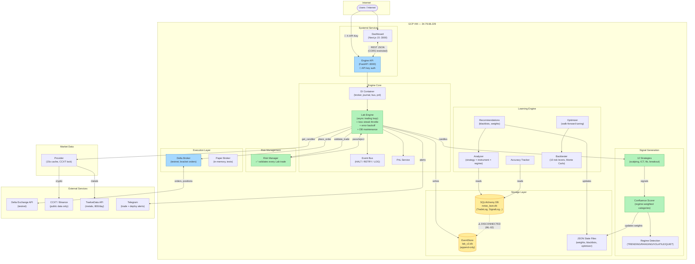
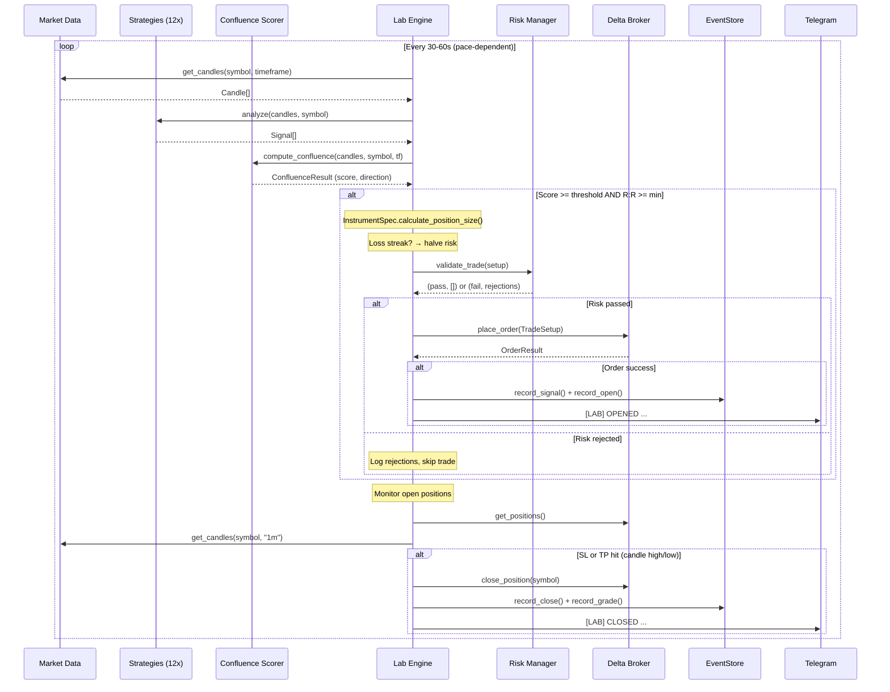
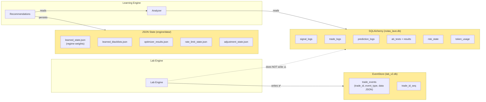
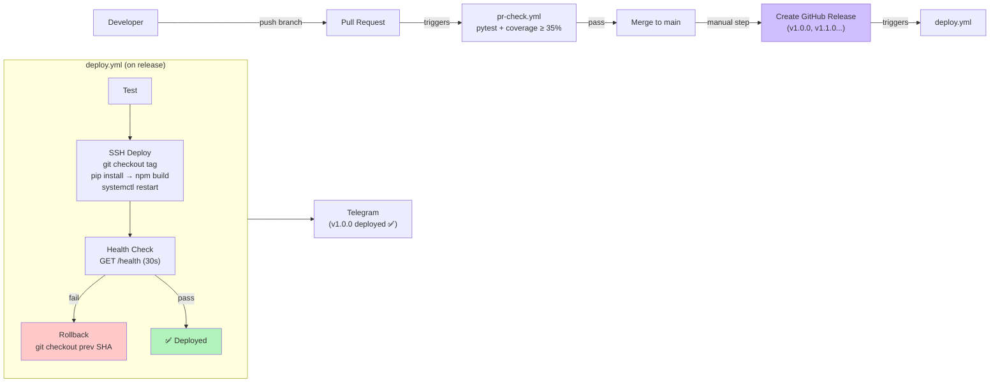
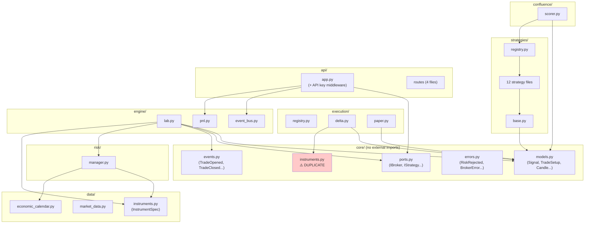

# Notas Lave — System Architecture

> Last verified against code: v1.0.0 (2026-03-28)

## System Overview

## Trading Loop (Data Flow)

## Storage Architecture

## CI/CD Pipeline

## Module Dependency Graph

## Component Inventory

| Component | Location | Purpose |
|-----------|----------|---------|
| FastAPI app | `api/app.py` | HTTP API, DI container, API key auth |
| Lab Engine | `engine/lab.py` | Autonomous trading loop |
| Confluence Scorer | `confluence/scorer.py` | Combine strategy signals |
| Risk Manager | `risk/manager.py` | Trade validation (used by Lab since v1.0.0) |
| Event Bus | `engine/event_bus.py` | Pub/sub with failure policies |
| P&L Service | `engine/pnl.py` | Balance - deposit = P&L |
| EventStore | `journal/event_store.py` | Append-only trade journal (Lab uses this) |
| Database | `journal/database.py` | SQLAlchemy ORM (Learning engine uses this) |
| Market Data | `data/market_data.py` | Multi-source candle provider |
| Strategies | `strategies/*.py` | 12 strategies, `BaseStrategy` + registry |
| Delta Broker | `execution/delta.py` | Delta Exchange API (only active broker) |
| Paper Broker | `execution/paper.py` | In-memory test broker |
| Instruments | `data/instruments.py` | InstrumentSpec (pip, spread, sizing) |
| Instruments (dup) | `core/instruments.py` | Instrument (exchange symbols) — **DUPLICATE, merge planned** |
| Config | `config.py` | Pydantic settings from .env |
| Alerts | `alerts/telegram.py` | Telegram notifications |
| Learning | `learning/*.py` | Analyzer, recommendations, optimizer, accuracy, A/B testing |
| Backtester | `backtester/engine.py` | Walk-forward backtesting with 10 risk levers |
| Monte Carlo | `backtester/monte_carlo.py` | Permutation test for robustness |
| Token Tracker | `monitoring/token_tracker.py` | Claude API cost tracking |

## Key Design Patterns

1. **DI Container** — `Container(broker, journal, bus, pnl)` passed to `create_app()`. No global state in API layer.
2. **Protocols** — `IBroker`, `IStrategy`, `ITradeJournal`, `IDataProvider`, `IRiskManager` in `core/ports.py`.
3. **Broker Registry** — `@register_broker("name")` decorator. `create_broker("name")` to instantiate.
4. **Event Bus** — `FailurePolicy.HALT | RETRY_3X | LOG_AND_CONTINUE` per subscriber.
5. **Append-Only Journal** — EventStore never UPDATEs, only INSERTs events.

## Known Architecture Issues

| ID | Issue | Impact | Status |
|----|-------|--------|--------|
| ML-02 | Two journal systems (EventStore vs SQLAlchemy) disconnected | ~Learning engine blind~ | **FIXED v1.1.0** (bridge writes to both) |
| QR-03 | Two instrument registries (`core/instruments.py` + `data/instruments.py`) | ~Spec divergence~ | **FIXED v1.1.0** (merged, core re-exports) |
| CQ-04 | Module-level singletons (`config`, `risk_manager`, `market_data`) | Side effects on import, hard to test | OPEN |
| QR-01 | Lab engine bypasses Risk Manager | ~No risk enforcement~ | **FIXED v1.0.0** |
| SE-01 | API open to internet with no auth | ~Anyone can read trading data~ | **FIXED v1.0.0** |

## Rules

- **No new globals.** Use the DI Container for all dependencies.
- **All models in `core/models.py`.** Don't add models in `data/models.py` — move them to core.
- **Protocols for all boundaries.** New adapters (brokers, data sources) implement protocols from `core/ports.py`.
- **Imports flow inward.** `core/` imports nothing outside `core/`. `engine/` and `api/` import from `core/`. Adapters (`execution/`, `data/`) import from `core/`.
- **Diagrams use Mermaid.** No binary diagram files — keep diagrams as code in markdown so they diff, render on GitHub, and cost minimal tokens to update.
- **Update diagrams when architecture changes.** If you add/remove a component, change data flow, or fix a known issue, update the relevant Mermaid diagram in this file.
